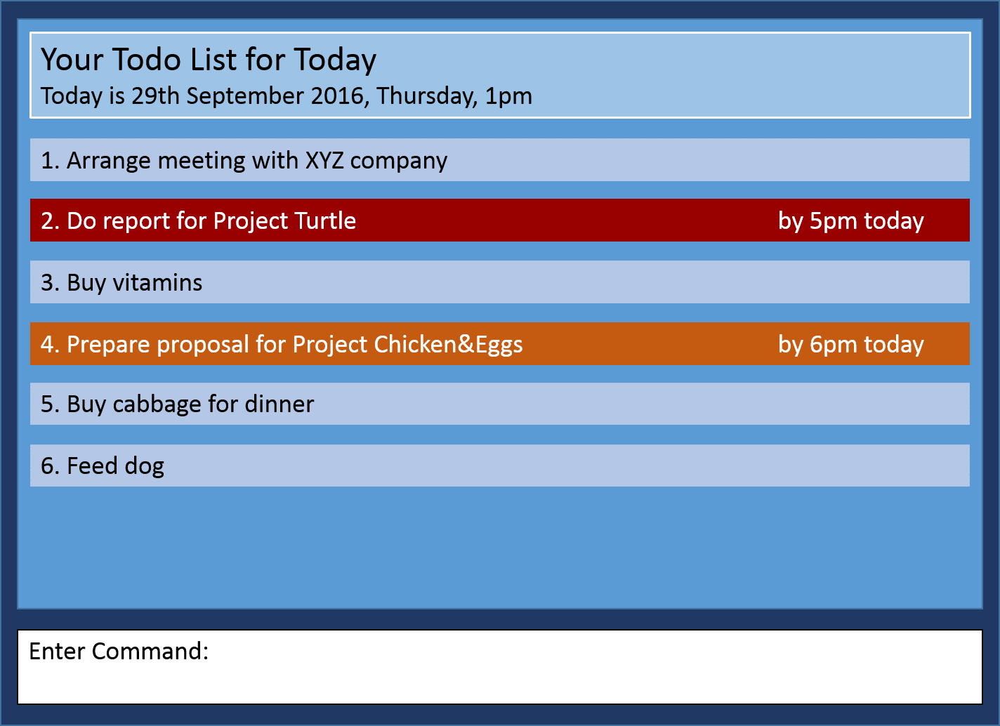

# Taskell

 

* This is a desktop task manager application. It has a GUI but most of the user interactions happen using 
  a CLI (Command Line Interface).
* It is a Java application built by students learning Software Engineering while using Java as 
  the main programming language. 
* It is **written in OOP fashion**. It provides a **reasonably well-written** code example that is 
  **significantly bigger** (around 6 KLoC)than what students usually write in beginner-level SE modules. 

  
#### Site Map
* [User Guide](docs/UserGuide.md) 
* [Developer Guide](docs/DeveloperGuide.md) 
* [Learning Outcomes](docs/LearningOutcomes.md) 
* [About Us](docs/AboutUs.md)
* [Contact Us](docs/ContactUs.md)

#### Acknowledgement

* Some parts of this sample application were inspired by the excellent 
  [Java FX tutorial](http://code.makery.ch/library/javafx-8-tutorial/) by *Marco Jakob*. 

#### License : [MIT](LICENSE)