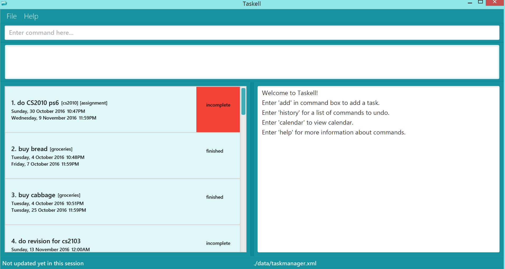

# Taskell

 

* This is a desktop task manager application. It has a GUI but most of the user interactions happen using 
  a CLI (Command Line Interface).
* It is a Java application built by Team Autumn, a team of students learning Software Engineering, using Java as 
  the main programming language. 
* It is **written in OOP fashion**. It provides a **reasonably well-written** code example that is 
  **significantly bigger** (around 6 KLoC)than what students usually write in beginner-level SE modules. 

  
#### Site Map
* [User Guide](docs/UserGuide.md) 
* [Developer Guide](docs/DeveloperGuide.md) 
* [Learning Outcomes](docs/LearningOutcomes.md) 
* [About Us](docs/AboutUs.md)
* [Contact Us](docs/ContactUs.md)

#### Acknowledgements

* Some parts of this application were inspired by the excellent 
  [Java FX tutorial](http://code.makery.ch/library/javafx-8-tutorial/) by *Marco Jakob*. 
* Some parts of this application were adapted from [Address Book 4](https://github.com/nus-cs2103-AY1617S1/addressbook-level4) by *Damith C. Rajapakse* and his team.
* The calendar view is implemented with the help of the [JFXtras Project](http://jfxtras.org/), specifically the [Agenda library](http://jfxtras.org/doc/8.0/jfxtras-agenda/index.html).
* Icon is sourced from [Iconfinder](https://www.iconfinder.com/icons/1525/cyan_folder_icon#size=128), and designed by [David Vignoni](http://www.icon-king.com/).

#### License : [MIT](LICENSE)
