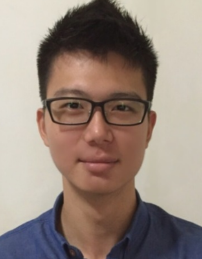
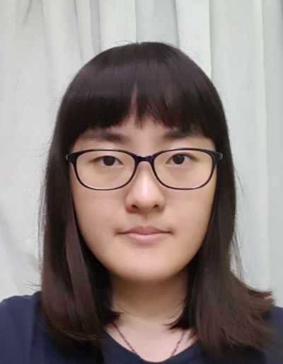

# About Us

We are a team based in the [School of Computing, National University of Singapore](http://www.comp.nus.edu.sg).

## Project Team

#### [Marcus Ng Wen Jian](https://github.com/marcusngwj)  
 
**Role**: Team Leader  
**Responsibilities**: Code Quality Control, Logic  
**Features implemented**: 
* Add Command
* TaskDate
* TaskTime
* Priority Colour

As a Team Leader, I will
* Be responsible for the overall project coordination
* Be the main point of contact for the group
* Liaise with Professor and Tutorial Assistants
* Ensure that each member of the team performs his/her roles dutifully
* Be responsible in creating a comfortable workflow structure for the team
 

As a Code Quality Surveyor, I will
* Look after the code quality
* Ensure that the team adhere to the Java coding standards
* Ensure that code follows software design principles

-----

#### [Jazlyn Ang Chue Ching](https://github.com/turtle96)
 

Role: Developer 
* Components in charge of: [Storage](https://github.com/CS2103AUG2016-W15-C3/main/blob/master/docs/DeveloperGuide.md#storage-component), 
[UI](https://github.com/CS2103AUG2016-W15-C3/main/blob/master/docs/DeveloperGuide.md#ui-component)
* Aspects/tools in charge of: Testing, Integration, Git
* Features implemented:
   * [Save Location](https://github.com/CS2103AUG2016-W15-C3/main/blob/master/docs/UserGuide.md#saving-the-information-in-taskell--save)
   * [Undo Command & Command History](https://github.com/CS2103AUG2016-W15-C3/main/blob/master/docs/UserGuide.md#reverting-previous-action--undo)
   * [Find Command](https://github.com/CS2103AUG2016-W15-C3/main/blob/master/docs/UserGuide.md#finding-tasks-find)
   * [Calendar View](https://github.com/CS2103AUG2016-W15-C3/main/blob/master/docs/UserGuide.md#showing-calendar-view--calendar-or-cal)
* Code written: [[functional code](https://github.com/CS2103AUG2016-W15-C3/main/tree/master/collated/main/A0142130A.md)][[test code](https://github.com/CS2103AUG2016-W15-C3/main/tree/master/collated/test/A0142130A.md)][[docs](https://github.com/CS2103AUG2016-W15-C3/main/tree/master/collated/docs/A0142130A.md)]
* Other major contributions:
  * Contributed to second round refactoring from AddressBook Level 4 to Taskell [[#64](https://github.com/CS2103AUG2016-W15-C3/main/pull/64) ]
  * Set up Travis and Coveralls 
  * Designed UI theme

-----

#### [Madasamy Ravi Nadar Mamtha](https://github.com/Mamtha3005) 
 
**Role**: Developer  
**Responsibilities**: Data, Documentation, Scheduling and Tracking of deadlines  
**Features implemented**: 
* Edit Command
* List Command

As a Documentation Leader, I will
* Be well-organised
* Be responsible for the quality of documents submitted by the team.
* Ensure that documents follow the format provided, if applicable. 
* Ensure that sentences in the document are grammatically correct, points are clear, concise, well-analysed and explained in a way everyone can understand
 

As a Scheduling Deputy Leader, I will
* Provide realistic deadlines for my team mates so that they can finish their part with good quality
* Remind them when deadlines are nearing, giving them enough time to prepare 
* Remind them on a regular basis, giving them suggested timeline so that they can gauge their working pace and better manage their time

-----

#### [Zuo ZhuoLin](https://github.com/ZuoZhuolin)
 
**Role**: Developer  
**Responsibilities**: Development and Operations, Testing, Scheduling and Tracking of deadlines  
**Features implemented**: 
* Done Command
* List Command

As a Scheduling Leader, I will
* Set realistic deadline for different milestones of the project
* Remind team mates when deadlines are nearing
 

As Testing Deputy Leader, I will
* Double check tests cover all the bases required for regression testing
* Ensures the testing of project is done properly and on time

-----

# Contributors

We welcome contributions. See [Contact Us](ContactUs.md) page for more info.

* [Damith C. Rajapakse](http://www.comp.nus.edu.sg/~damithch/)
* [Joshua Lee](https://github.com/lejolly)
* [Leow Yijin](https://github.com/yijinl)
* [Martin Choo](https://github.com/m133225)
* [Thien Nguyen](https://github.com/ndt93)
* [You Liang](https://github.com/yl-coder)
* [Akshay Narayan](https://github.com/se-edu/addressbook-level4/pulls?q=is%3Apr+author%3Aokkhoy)
* [Sam Yong](https://github.com/se-edu/addressbook-level4/pulls?q=is%3Apr+author%3Amauris)
