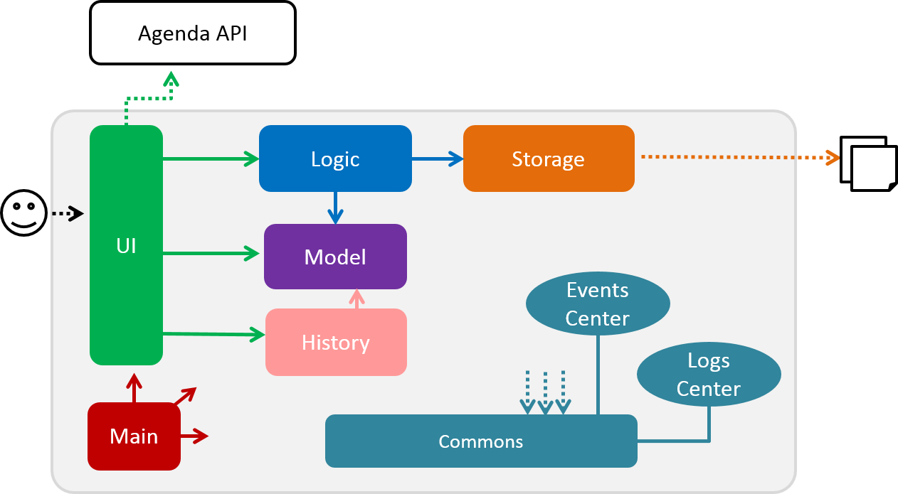
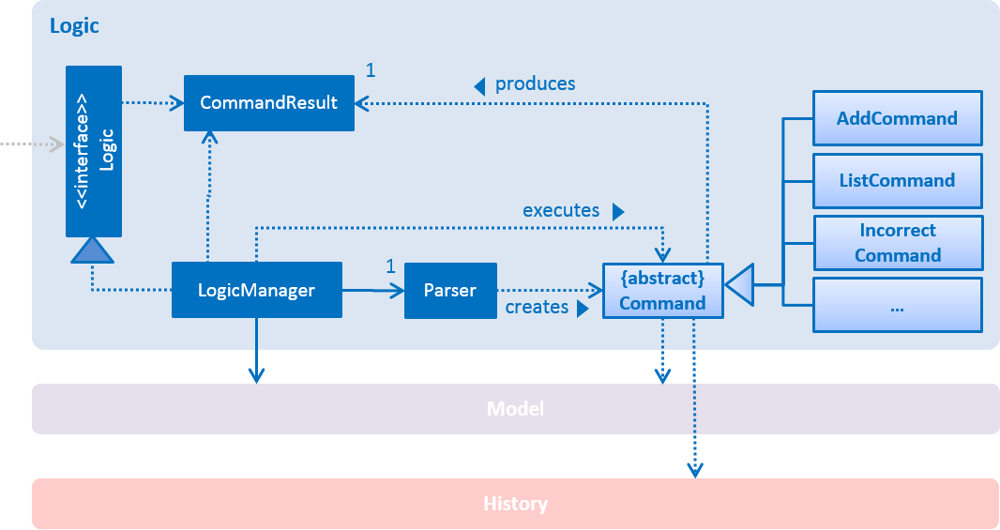
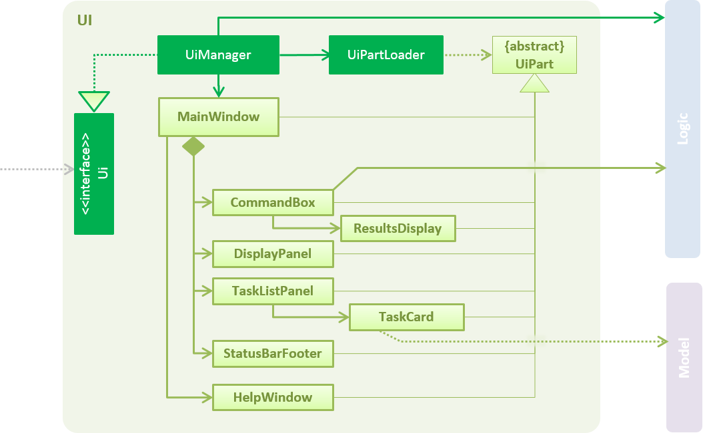
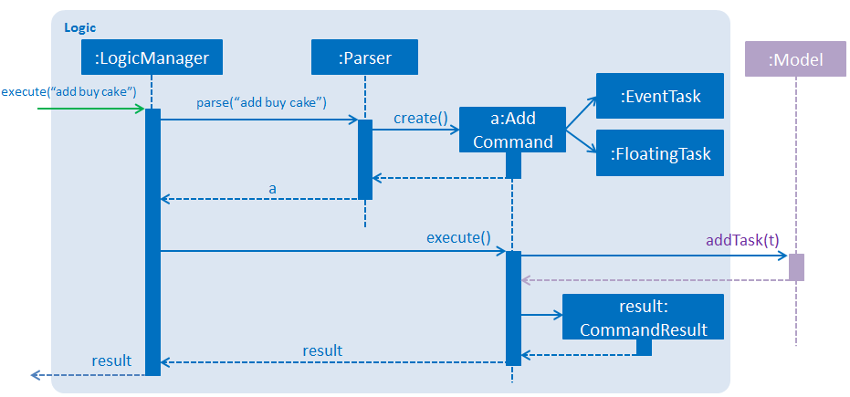
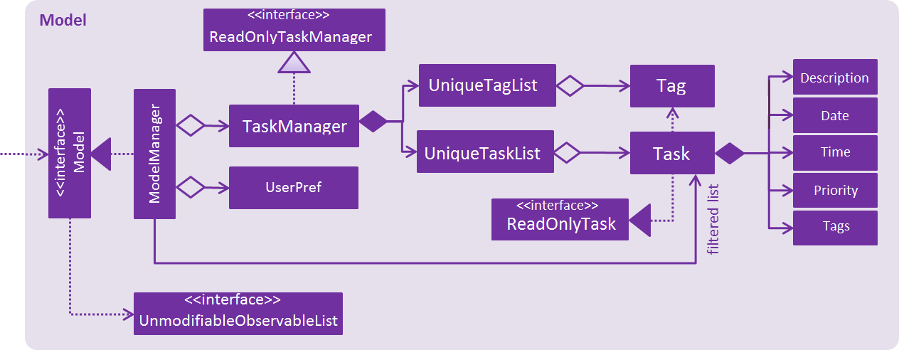
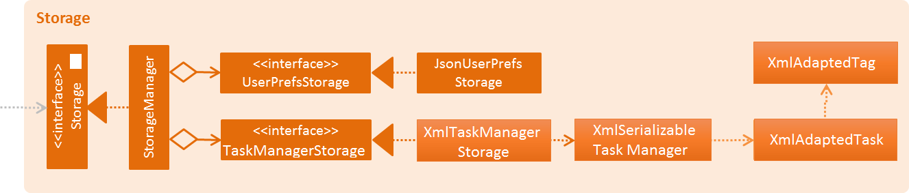

# Developer Guide 

* [Introduction](#introduction)
* [Setting Up](#setting-up)
* [Design](#design)
* [Implementation](#implementation)
* [Testing](#testing)
* [Dev Ops](#dev-ops)
* [Appendix A: User Stories](#appendix-a--user-stories)
* [Appendix B: Use Cases](#appendix-b--use-cases)
* [Appendix C: Non Functional Requirements](#appendix-c--non-functional-requirements)
* [Appendix D: Glossary](#appendix-d--glossary)
* [Appendix E : Product Survey](#appendix-e-product-survey)

<!- @@author A0142073R --->
##Introduction

Taskell is a simple software for users to keep track of their daily tasks and manage their busy schedule. Keyboard lovers will be able to experience the full benefit of Taskell as it implements a command-line interface.

This developer guide will help you understand the design and implementation of Taskell. It helps you understand how Taskell works and how you can contribute for further development. This guide follows a top-down approach by giving an overview of the essential components first, followed by thorough explanation subsequently.
<!-- @@author -->

## Setting Up

#### Prerequisites

1. **JDK `1.8.0_60`**  or later 

    > Having any Java 8 version is not enough.  
    This app will not work with earlier versions of Java 8.
    
2. **Eclipse** IDE
3. **E(fx)clipse** plugin for Eclipse (Do the steps 2 onwards given in
   [this page](http://www.eclipse.org/efxclipse/install.html#for-the-ambitious))
4. **Buildship Gradle Integration** plugin from the Eclipse Marketplace

#### Importing The Project Into Eclipse

0. Fork this repository, and clone the fork to your computer
1. Open Eclipse (Note: Ensure you have installed the **e(fx)clipse** and **buildship** plugins as given in the prerequisites above)
2. Click `File` > `Import`
3. Click `Gradle` > `Gradle Project` > `Next` > `Next`
4. Click `Browse`, then locate the project's directory
5. Click `Finish`

  > * If you are asked whether to 'keep' or 'overwrite' configuration files, choose to 'keep'.
  > * Depending on your connection speed and server load, it can even take up to 30 minutes for the set up to finish
      (This is because Gradle downloads library files from servers during the project set up process)
  > * If Eclipse auto-changed any settings files during the import process, you can discard those changes.
  
#### Troubleshooting project setup

**Problem: Eclipse reports compile errors after new commits are pulled from Git**
* Reason: Eclipse fails to recognize new files that appeared due to the Git pull. 
* Solution: Refresh the project in Eclipse:  
  Right click on the project (in Eclipse package explorer), choose `Gradle` -> `Refresh Gradle Project`.
  
**Problem: Eclipse reports some required libraries missing**
* Reason: Required libraries may not have been downloaded during the project import. 
* Solution: [Run tests using Gardle](UsingGradle.md) once (to refresh the libraries).
 

## Design

### Architecture

 

<em>Diagram 1: Architecture Diagram</em>

The Architecture Diagram given above explains the high-level design of the Application.
Given below is a quick overview of each component. 

`Main` has only one class called [`MainApp`](../src/main/java/seedu/taskell/MainApp.java). It is responsible for,
* At application launch: Initializes the components in the correct sequence, and connects them up with each other.
* At shut down: Shuts down the components and invokes cleanup method where necessary.

[**`Commons`**](#common-classes) represents a collection of classes used by multiple other components.
Two of those classes play important roles at the architecture level.
* `EventsCentre` : Used by components to communicate with other components using events (i.e. a form of _Event Driven_ design)(written using [Google's Event Bus library](https://github.com/google/guava/wiki/EventBusExplained))

* `LogsCenter` : Used by many classes to write log messages to the Application's log file.

The rest of the Application consists four components.
* [**`UI`**](#ui-component) : UI of the Application.
* [**`Logic`**](#logic-component) : Command executor.
* [**`Model`**](#model-component) : Data Holder of the Application in-memory.
* [**`Storage`**](#storage-component) : Data read from, and written to the hard disk.

Each of the four components
* Defines its _API_ in an `interface` with the same name as the Component.
* Exposes its functionality using a `{Component Name}Manager` class.

 

<em>Diagram 2: Logic Class Diagram</em>

The `Logic` component above defines it's API in the `Logic.java`
interface and exposes its functionality using the `LogicManager.java` class. 

 

<em>Diagram 3: Sequence Diagram for Delete Task</em>

The Sequence Diagram above shows how the components interact for the scenario where the user issues the
command `delete 1`.

>Note how the `Model` simply raises a `TaskManagerChangedEvent` when the Task Manager data is changed,
 instead of asking the `Storage` to save the updates to the hard disk.

 

<em>Diagram 4: Sequence Diagram for Delete Task Event Handling</em>

The diagram above shows how the `EventsCenter` reacts to that event, which eventually results in the updates
being saved to the hard disk. The status bar of the UI is updated to reflect the 'Last Updated' time.  

> Note how the event is propagated through the `EventsCenter` to the `Storage` and `UI` without `Model` having
  to be coupled to either of them. This is an example of how this Event Driven approach helps us reduce direct 
  coupling between components.

The sections below give more details of each component.

### UI Component

 

<em>Diagram 5: UI Class Diagram </em>

The diagram above gives an overview of how the `UI`component is implemented. 

**API** : [`Ui.java`](../src/main/java/seedu/taskell/ui/Ui.java)

The UI consists of a `MainWindow` that is made up of parts e.g.`CommandBox`, `ResultDisplay`, `TaskListPanel`,
`StatusBarFooter`, `BrowserPanel` etc. All these, including the `MainWindow`, inherit from the abstract `UiPart` class
and they can be loaded using the `UiPartLoader`.

The `UI` component uses JavaFx UI framework. The layout of these UI parts are defined in matching `.fxml` files
 that are in the `src/main/resources/view` folder. 
 For example, the layout of the [`MainWindow`](../src/main/java/seedu/taskell/ui/MainWindow.java) is specified in
 [`MainWindow.fxml`](../src/main/resources/view/MainWindow.fxml)

The `UI` component,
* Executes user commands using the `Logic` component.
* Binds itself to some data in the `Model` so that the UI can auto-update when data in the `Model` changes.
* Responds to events raised from various parts of the Application and updates the UI accordingly.

### Logic Component

 

<em>Diagram 6: Logic Class Diagram </em>

The diagram above gives an overview of how the `Logic`component is implemented. 
 **API** : [`Logic.java`](../src/main/java/seedu/taskell/logic/Logic.java)

The `Logic` component,
* Uses the `Parser` class to parse the user command, resulting in a `Command` object which is executed by the `LogicManager`.
* Affects the `Model` (e.g. adding a task) and/or raise events.
* Executes the necessary command and the result is encapsulated as a  `CommandResult` to be passed back to the `UI`.

 
  
<em>Diagram 7: Add Task Sequence Diagram For Logic</em>

The diagram above shows the Sequence Diagram for interactions within the `Logic` component for the `execute("delete 1")`
 API call. 
 
### Model Component

 

<em>Diagram 7: Model Class Diagram </em>

The diagram above gives an overview of how the `Model` component is implemented. 
 **API** : [`Model.java`](../src/main/java/seedu/taskell/model/Model.java)

The `Model` component,
* stores a `UserPref` object that represents the user's preferences.
* stores the Task Manager data.
* exposes a `UnmodifiableObservableList<ReadOnlyTask>` that can be 'observed' e.g. the UI can be bound to this list
  so that the UI automatically updates when the data in the list change.
* does not depend on any of the other three components.

### Storage Component

 

<em>Diagram 8: Storage Class Diagram </em>

The diagram above gives an overview of how the `Storage` component is implemented. 
 **API** : [`Storage.java`](../src/main/java/seedu/taskell/storage/Storage.java)

The `Storage` component,
* can save `UserPref` objects in json format and read it back.
* can save the Task Manager data in xml format and read it back.

### Common Classes

Classes used by multiple components are in the `seedu.taskmanager.commons` package.

## Implementation

### Logging

We are using `java.util.logging` package for logging. The `LogsCenter` class is used to manage the logging levels
and logging destinations.

* The logging level can be controlled using the `logLevel` setting in the configuration file
  (See [Configuration](#configuration))
* The `Logger` for a class can be obtained using `LogsCenter.getLogger(Class)` which will log messages according to
  the specified logging level
* Currently log messages are output through: `Console` and to a `.log` file.

**Logging Levels**

* `SEVERE` : Critical problem detected which may possibly cause the termination of the application
* `WARNING` : Program can continue, but with caution
* `INFO` : Information showing the noteworthy actions by the Application
* `FINE` : Details that is not usually noteworthy but may be useful in debugging
  e.g. print the actual list instead of just its size

### Configuration

Certain properties of the application can be controlled (e.g Application name, logging level) through the configuration file 
(default: `config.json`):

## Testing

Tests can be found in the `./src/test/java` folder.

**In Eclipse**:
* To run all tests, right-click on the `src/test/java` folder and choose
  `Run as` > `JUnit Test`
* To run a subset of tests, right-click on a test package, test class, or a test and choose
  to run as a JUnit test.

**Using Gradle**:
* See [UsingGradle.md](UsingGradle.md) for how to run tests using Gradle.

We have two types of tests:

1. **GUI Tests** - These are _System Tests_ that test the entire Application by simulating user actions on the GUI. 
   These are in the `guitests` package.
  
2. **Non-GUI Tests** - These are tests not involving the GUI. They include,
   1. _Unit tests_ targeting the lowest level methods/classes.  
      e.g. `seedu.taskell.model.task.TaskDateTest`
   2. _Integration tests_ that are checking the integration of multiple code units 
     (those code units are assumed to be working). 
      e.g. `seedu.taskell.storage.StorageManagerTest`
   3. Hybrids of unit and integration tests. These tests are checking multiple code units as well as 
      how the are connected together. 
      e.g. `seedu.taskell.logic.LogicManagerTest`
  
**Headless GUI Testing** :
Thanks to the [TestFX](https://github.com/TestFX/TestFX) library we use,
 our GUI tests can be run in the headless mode. 
 In the headless mode, GUI tests do not show up on the screen.
 That means the developer can do other things on the Computer while the tests are running. 
 See [UsingGradle.md](UsingGradle.md#running-tests) to learn how to run tests in headless mode.
 
#### Troubleshooting tests
 **Problem: Tests fail because NullPointException when AssertionError is expected**
 * Reason: Assertions are not enabled for JUnit tests. 
   This can happen if you are not using a recent Eclipse version (i.e. _Neon_ or later)
 * Solution: Enable assertions in JUnit tests as described 
   [here](http://stackoverflow.com/questions/2522897/eclipse-junit-ea-vm-option).  
   Delete run configurations created when you ran tests earlier.
  
## Dev Ops

### Build Automation

See [UsingGradle.md](UsingGradle.md) to learn how to use Gradle for build automation.

### Continuous Integration

We use [Travis CI](https://travis-ci.org/) to perform _Continuous Integration_ on our projects.
See [UsingTravis.md](UsingTravis.md) for more details.

### Making a Release

Here are the steps to create a new release.
 
 1. Generate a JAR file [using Gradle](UsingGradle.md#creating-the-jar-file).
 2. Tag the repository with the version number. e.g. `v0.1`
 2. [Create a new release using GitHub](https://help.github.com/articles/creating-releases/) 
    and upload the JAR file your created.
   
### Managing Dependencies

A project often depends on third-party libraries. For example, Taskell depends on the
[Jackson library](http://wiki.fasterxml.com/JacksonHome) for XML parsing. Managing these _dependencies_
can be automated using Gradle. For example, Gradle can download the dependencies automatically, which
is better than these alternatives. 
a. Include those libraries in the repository (this bloats the repository size) 
b. Require developers to download those libraries manually (this creates extra work for developers) 

<!- @@author A0142073R --->
## Appendix A : User Stories

Priorities: High (must have) - `* * *`, Medium (nice to have)  - `* *`,  Low (unlikely to have) - `*`

Priority | As a ... | I want to ... | So that I can...
-------- | :---------- | :--------- | :-----------
`* * *` | new user | see user guide | refer to the different commands when I forget how to use the application.
`* * *` | user |  add a task | take note of all my tasks.
`* * *` | user | delete a task | remove task that I no longer need.
`* * *` | user | find a task by its description | locate details of tasks without having to go through the entire list.
`* * *` | user | categorize my tasks | group and view tasks of similar type.
`* * *` | user | view all the tasks, sorted by day, month | plan my schedule.
`* * *` | user | edit task | make changes to the task created.
`* * *` | user | have a start and end time for an event | take note of the duration of the event.
`* * *` | user | set deadlines for a task | remember when the task is due.
`* * *` | user | undo my previous action | correct any mistakes made.
`* * *` | user | mark a task as done | focus on the uncompleted tasks.
`* * *` | user | have flexible command format |have various options to execute a command.
`* * *` | user | specify a folder with cloud syncing service as the storage location | I can easily access my task manager from different computers.
`* * *` | user | I want to see a list of completed tasks | view all the tasks I had done.
`* *` | user |  delete tasks based on a certain index | delete a few tasks instead of one.
`*` | user | set some of my task recursively | schedule them on a daily/weekly/monthly basis.
`*` | user | be able to block multiple timeslots, and release the timeslots when timing is confirmed|  schedule in events which have uncertain timings more efficiently.
`*` | user | sort tasks by priority | view the most important tasks.
`*` | user | edit my notification time period | customise if I wanted to be reminded earlier or later.
`*` | user |  use the history command | saves time typing repeated commands.
`*` | user |  view the task in either calendar form or list form |  switch between the two display format.
<!-- @@author -->

<!- @@author A0139257X --->
## Appendix B : Use Cases

#### Use case: Add task

**MSS**

1. User requests to add tasks

2. Taskell adds the task 
Use case ends

**Extensions**

2a. The user did not follow the given format to add the task

> 2a1. Taskell displays invalid command format warning 
  Use case resumes at step 1

#### Use case: Delete task

**MSS**

1. User requests to list tasks
2. Taskell shows a list of uncompleted tasks
3. User requests to delete a specific task in the list
4. Taskell deletes the task  
Use case ends

**Extensions**

2a. The list is empty

3a. The given index is invalid

> 3a1. Taskell shows an error message  
  Use case resumes at step 2

#### Use case: Done task

**MSS**

1. User requests to list tasks
2. Taskell shows a list of uncompleted tasks
3. User requests to mark a specific task in the list as completed
4. Taskell marks the task as completed 
Use case ends

**Extensions**

2a. The list is empty

3a. The given index is invalid

> 3a1. Taskell shows an error message  
  Use case resumes at step 2

4a. User tries to mark a completed task as completed
  
#### Use case: Help task

**MSS**

1. User requests to view the different command
2. User enters "help"
3. User displays a summary of all the different command.
Use case ends

**Extensions**

2a. The user types "help" incorrectly

> 3a1. Taskell stil displays the help message  

#### Use case: Find task

**MSS**

1. User requests to find tasks with specific keywords
2. Taskell displays the tasks with all matching keywords  
Use case ends

**Extensions**

1a. No keyword is given

> 1a1. Taskell shows an error message  

#### Use case: Edit task

**MSS**

1. User requests to list tasks
2. Taskell shows a list of tasks
3. User requests to edit either the description, date, time or priority of a task
4. Taskell edits the respective field
5. Taskell displays the both the old and updated version of the task  
Use case ends

**Extensions**

2a. The list is empty

3a. The given index is invalid
3b. The user did not key in the new field of the task
3c. The user did not key in a valid parameter

> 3a1, 3b1 and 3c1. Taskell shows an error message  
  Use case resumes at step 2

#### Use case: Undo task

**MSS**

1. User enters a command
2. Taskell executes it
3. User requests to list undo commands history
4. User requests to undo command at specific index
5. Taskell revert the command  
Use case ends

**Extensions**

3a. The user did not enter any previous command

> 3a1. Taskell shows a message indicating no commands available for undo 

4a. The user enters invalid index

> 4a1. Taskell shows error message indicating index is invalid 

#### Use case: List task

**MSS**

1. User requests to list either all tasks, incomplete tasks, completed tasks, task with specific start date or task with specific priority
2. Taskell shows a list of tasks accordingly
Use case ends

**Extensions**

2a. The list is empty

> 2a1. Taskell shows an error message  
  Use case resumes at step 2
  
#### Use case: View calendar for the week

**MSS**

1. User requests to view calendar
2. Taskell displays calendar
  
#### Use case: Save data to specified folder

**MSS**

1. User requests to save all tasks
2. Taskell saves all tasks in the requested folder  
Use case ends

**Extensions**

2a. Data cannot be written to the requested folder (invalid directory or access prohibited)

> 2a1. Taskell shows an error message and still saves data in previous old location. 

#### Use case: Clear task

**MSS**

1. User requests to clear all tasks
2. Taskell deletes all tasks
Use case ends

**Extensions**

2a. The list is empty

> 2a1. Taskell shows an error message  

#### Use case: Exit task

**MSS**

1. User requests to exit Taskell
2. Taskell saves all the data and stops
Use case ends

**Extensions**

NIL
<!-- @@author -->
## Appendix C : Non Functional Requirements

1. Should work on any [mainstream OS](#mainstream-os) as long as it has Java `1.8.0_60` or higher installed.
2. Should be able to hold up to 1000 tasks.
3. Should come with automated unit tests and open source code.
4. Should favor DOS style commands over Unix-style commands.
5. Should execute commands under 5 seconds.

## Appendix D : Glossary

##### Mainstream OS

> Windows, Linux, Unix, OS-X

##### Floating Tasks

> Tasks with no deadline

## Appendix E : Product Survey
#### WunderList
**Pros:** 
1. Has support for cross-platform operations 
2. Can share tasks with other people and manage them  
3. Can categorize tasks into different categories 
4. Can attach different types of file inside the task, such as photos, PDF and PowerPoint 

**Cons:** 
1. Has limited number of priority levels 
2. Has no undo operation 

#### Remember the Milk
**Pros:** 
1. Can be used offline and tasks are synced once internet connection is established 
2. Can handle some natural language processing by saving deadlines from task information itself (e.g. Do math homework tomorrow: Saves task with deadline set to tomorrow) 
3. Can undo when marking tasks as done (recover from accidentally marking a task as done) 
4. Can set priority, and list tasks by priority 
5. Can set recursive tasks 

**Cons:** 
1. Need to click frequently to enter or edit a task 
2. Need to remember lots of shortcuts, so user is less likely to use them 
3. Has a cluttered interface, which is not intuitive 
4. Does not support calendar view in-house 

#### Google Calendar
**Pros:** 
1. Can add in public holidays  
2. Can update in terms of time zone 
3. Can customize background picture 

**Cons:** 
1. Does not have flexibility in viewing the calendar 
2. Has too much information in 1 page in application 

#### Any.do
**Pros:** 
1. Displays a reminder when the task is almost due (set in advance) 
2. Able to clear all tasks in one go 
3. Do a daily review at the start/end of day 
4. Arranges tasks by today, tomorrow, someday 

**Cons:** 
1. Requires internet connection 
2. Has no support for recurring tasks 