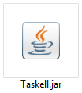
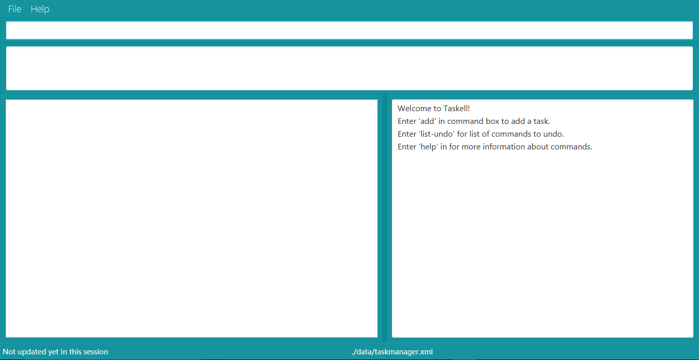
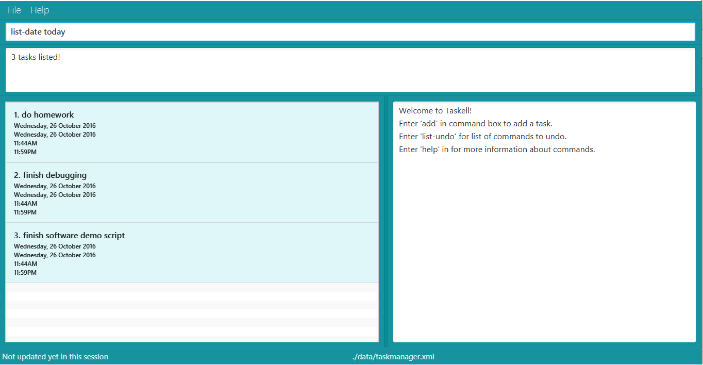
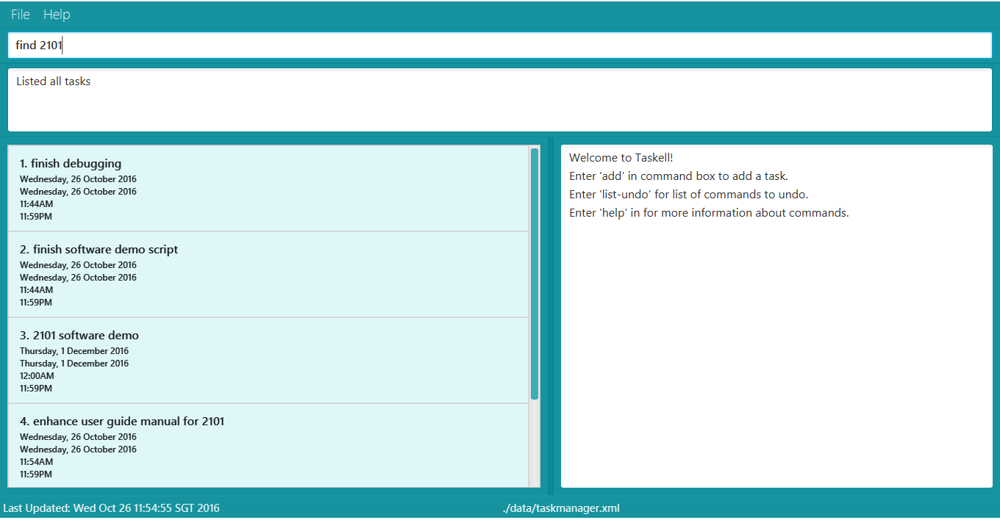
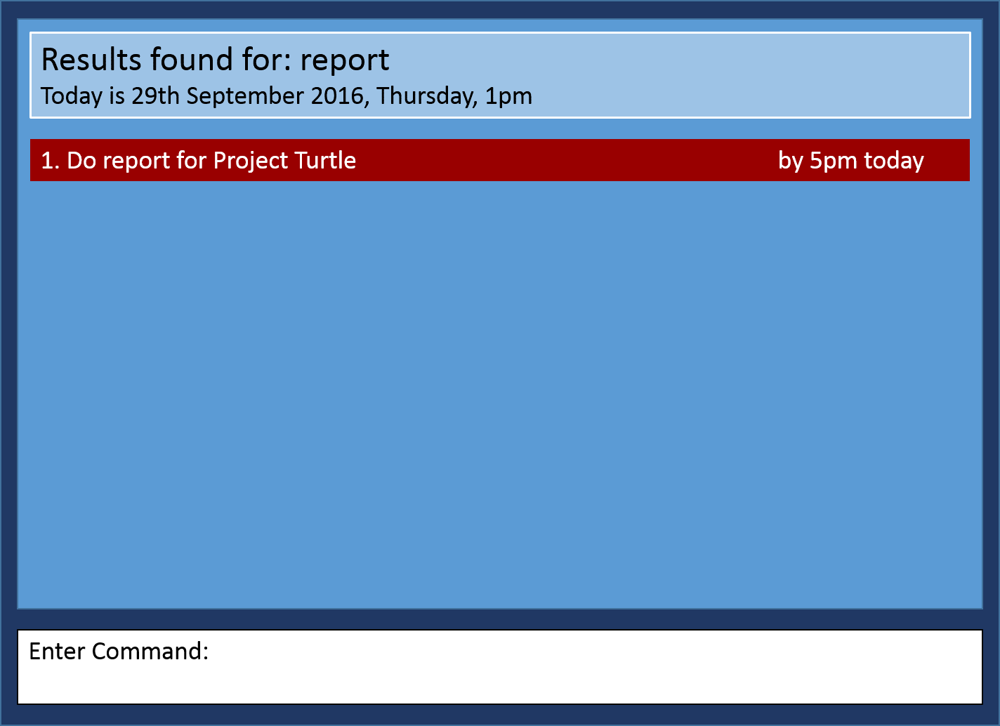
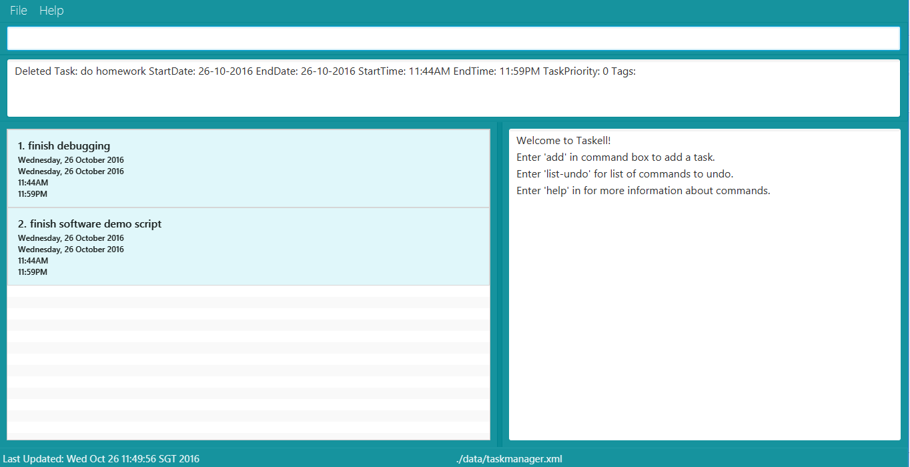
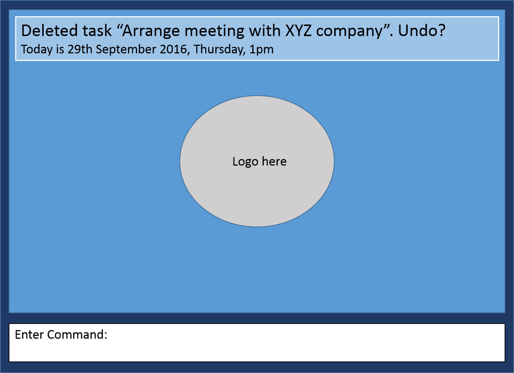
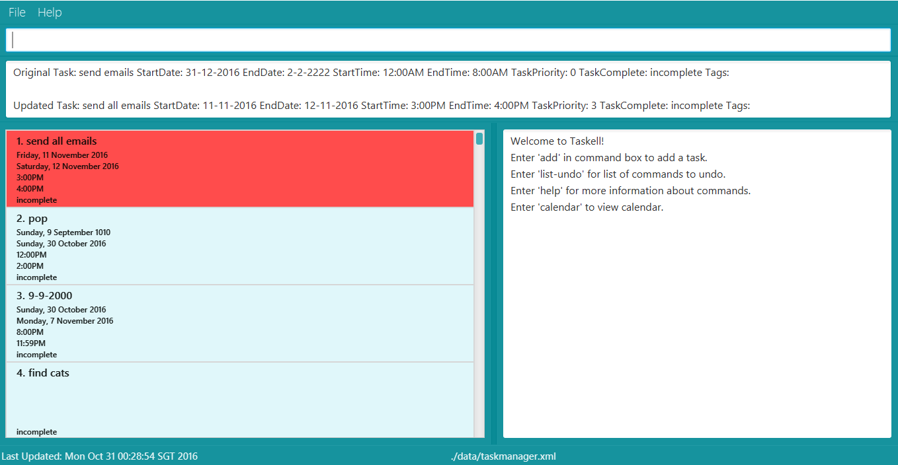

# User Guide
* [Quick Start](#quick-start)
* [Features](#features)
* [FAQ](#faq)
* [Command Summary](#command-summary)

## Quick Start

Step 1: Ensure you have Java version `1.8.0_60` or later installed in your Computer. 
   > Having any Java 8 version is not enough.  
   This application will not work with earlier versions of Java 8.
   
Step 2: Download the latest `taskell.jar` from here. 
	  
Step 3: Copy the file to the folder you want to use as the home folder for your Task Manager. 
Step 4: Double-click the file to start the application. The GUI should appear in a few seconds.  
  
Picture 1: A screenshot of the Graphical User Interface (GUI) 
Step 5:	Type the relevant command in the command box and press enter to execute it. 
 Step 6: Some example commands you can try: 
   * **`list`** : `lists` all contacts
   * **`add`**` buy MA1101R textbook today` : ` adds` a task called buy MA1101R textbook to be done `by` today.
   * **`delete`**` 3` : `deletes` the 3rd task shown in the current list
   * **`exit`** : `exits` the application  
Refer to the [Features](#features) section below for details of each command. 

## Features

**Command Format**
> * Words in `UPPER_CASE` are the parameters.
> * Items in `SQUARE_BRACKETS` are optional.
> * The parameters have to be in the given order below.

#### Viewing list of commands : `help`

When unsure of the available commands or command format, Enter help. 
If you enter an incorrect command eg. search, the instruction for using each command will be displayed as well. 
 
 Format: `help`
 
#### Adding a task: `add`
To add a new task to Taskell, use the add command. 
Formats: 
- `add TASK ITEM`  
This format can be used to add floating tasks without any deadlines. 
> Example: `add read Harry Potter Book`  
- `add TASK ITEM by [DATE]`  
This format can be used to add events held on a certain day. 
> Example: `add buy MA1101R textbook by today`  
> Example: `add do CS2100 assignment by 10th August` 
> Example: `add go shopping by tomorrow` 
- `add TASK ITEM by [DATE][TIME]`  
This format can be used to add tasks with a stipulated deadline. 
> Example: `add do lab homework on Friday 7pm`  
-  `add TASK ITEM on [DATE]`  
The use of word “on” gives more flexibility for you. 
> Example: `add schedule meeting on Thursday`  
- `add TASK ITEM on [DATE][TIME]`  
> Example: `add meet teacher on Friday 7pm`  

TAKE NOTE! DATES NEED TO REFER TO THE CURRENT WEEK DATES THE TASK WAS KEYED IN.EG. "TOORROW" AND "THURSDAY" IS VALID BUT "NEXT SATURDAY" IS INVALID. ONLY THE WORDS "ON" OR"BY" HAS TO BE USED TO DISTINGUISH BETWEEN DEADLINE AND TASK DESCRIPTION. 

#### Listing all tasks : `list`
To view a list of all the tasks, <kbd>Enter<kbd> list. 
 
Formats: 
- `list`  
Prints a list of all the uncompleted tasks. 
- `list DATE`   
Prints a list of all the completed tasks. 
- `list DONE`  
Prints a list of all the tasks due on the specific date. 
     
Picture 2: List of tasks due today printed when “List today” is keyed in.
   
#### Finding tasks: `find`
To view tasks with similar keyword, use the find command. 
Formats:  
-`find KEYWORD [MORE_KEYWORDS]` 
Prints a list of activities that match the keywords. 
Example: `find banana milk essay: returns any task description having keywords banana, milk, essay.`  
-`find-tag KEYWORD ` 
Prints list of activities with the same tag. 
 
  

Picture 3 and 4: Keying in “find report” displays list of tasks with report as one of the keywords in task description

> * Take Note! The order of the keywords does not matter. e.g. `chicken egg` will match `egg chicken`.
> * Full words will be matched e.g. `chicken` will match `chickens`.
> * Tasks matching at least one keyword will be returned (i.e. `OR` search).
    e.g. `chicken` will match `chicken duck`

#### Reverting previous action : `undo`
If you wish to undo your previous action, <kbd>Enter</kbd> undo. 
Format: `undo`

#### Deleting a task : `delete`
To delete a task, use the delete command. This command deletes the task at a specified INDEX. The index refers to the index number shown in the most recent listing. 
Format: `delete INDEX` 
 
  
Picture 5: Entering delete 1 will delete “Arrange meeting with XYZ company” 
Example:
* `find violin, then delete 1: deletes the 1st task in the results of the find command.`

> Take Note! This action can be reversed via undo, only if no new commands are entered 
> after deleting.

#### Editing a task : `edit`
To edit a task, use the edit command. This command edits the task at a specified INDEX. The index refers to the index number shown in the most recent listing. 
Format: `edit INDEX NEWTASK` 
   
Picture 6: edit 2 schedule meeting on wednesday: edits the 2nd task in Taskell to “schedule meeting on wednesday”.

#### Saving the information in Taskell
Specify the path of a new folder to store the data file of Taskell. The user should have permissions to access the folder. 

#### Clearing all entries : `clear`
To clear all tasks, <kbd>Enter</kbd> clear. 
Format: `clear`  

#### Exiting the program : `exit`
To close Taskell, <kbd>Enter</kbd> exit. 
Format: `exit`  

>  Done already? So where are all these information saved? No need to worry, Taskell will 
>  have them saved it for you!

## FAQ

**Q**: How do I transfer my data to another Computer? 
**A**: Install the application in the other computer and overwrite the empty data file it creates with the file that contains the data of your previous Taskell folder.
       
## Command Summary

Command | Format  
-------- | :-------- 
Add floating task | `add TASK ITEM `
Add event | `add TASK ITEM by [DATE]`
Add event | `add TASK ITEM by [TIME]`
Add event with deadline | `add TASK ITEM by [DATE][TIME]`
Clear | `clear`
Delete | `delete INDEX`
Find | `find KEYWORD [MORE_KEYWORDS]`
Find tag | `find-tag KEYWORD`
List | `list`
List Given Day | `list [DATE]`
List Tasks Done | `list [DONE]`
Help | `help`
Undo | `undo`
