# User Guide
* [Introduction](#introduction)
* [Quick Start](#quick-start)
* [Features](#features)
* [FAQ](#faq)
* [Glossary](#glossary)
* [Command Summary](#command-summary)
* [Appendix A](#appendix-a)
* [Appendix B](#appendix-b)

<!--- @@author A0142073R ---> 

## Introduction
Are you having a hard time remembering all the work you have to do? Do you have trouble finding a task manager that suits your preference for keyboard input? Well, worry no more, Taskell is here for you!  
Taskell will be your personal secretary. It will keep track of your daily tasks and remind you of any important dates and deadlines. What distinguishes Taskell from other task managers is that Taskell only requires a single line of command for every task input. This means that you can record each one of your tasks with just a single statement. You will no longer have to use a mouse if you do not wish to.  
Ready to begin life anew with a more efficient task manager? Read on to find out more! 

<!--- @@author --> 

## Quick Start
This section guides you through the installation of Taskell.  
Step 1: Ensure you have Java version `1.8.0_60` or later installed in your Computer. 

  > Having any Java 8 version is not enough.  
    This application will not work with earlier versions of Java 8.

Step 2: Download the latest `Taskell.jar` from <a href="https://github.com/CS2103AUG2016-W15-C3/main/releases">here</a>. 
	  &nbsp; &nbsp; &nbsp; &nbsp;  
	
Step 3: Copy the file to the folder you want to use as the home folder for your Task Manager. 
Step 4: Double-click the file to start the application. The GUI should appear in a few seconds.
  
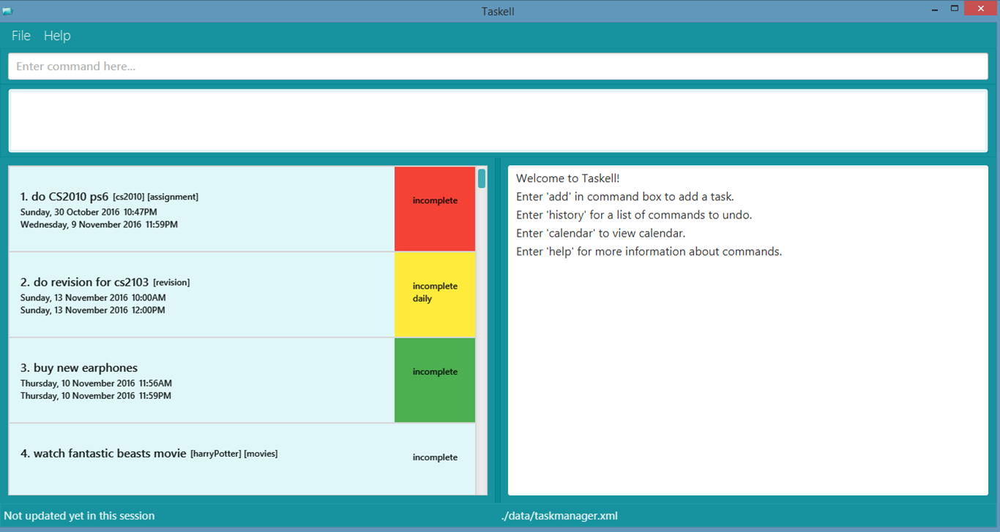 
Figure 1: A screenshot of the Graphical User Interface (GUI) 

Step 5:	Type the relevant command in the command box and press <kbd>Enter</kbd> to execute it. 
Step 6: Some example commands you can try: 
   * `list` : Displays all tasks
   * `add` buy MA1101R textbook today : Adds a task called buy MA1101R textbook to be done by today
   * `delete` 3 : Deletes the third task shown in the current list
   * `exit` : Exits the application  
Refer to the [Features](#features) section below for details of each command. 

<!--- @@author A0139257X --->
## Features

This section shows the different commands that you can use in Taskell. Words that are in UPPER_CASE are parameters. The parameters are listed below.
- TASK: Indicates the content of a work
- DATE: Indicates a date

> Please refer to Appendix A for the date formats that Taskell supports.   
> Default start date has been set to today's date.  
> Default end date has been set to be the same as the start date.  

- TIME: Indicates a time

> Please refer to Appendix B for the time formats that Taskell supports.  
> Default start time has been set to 12:00AM  
> Default end time has been set to 11:59PM  
> If the task is added today and no start time is provided, the default start time will be set to the current time.

- PRIORITY: Indicates the level of importance of a task ranging from level 0 to 3. Level 0, 1, 2, 3 indicates default, low, medium and high priority respectively

> In the GUI, level 1,2 and 3 tasks are marked as green, yellow and red respectively. Tasks with default priority level are not marked with any colors.

- RECURRING: Indicates the repetitive nature of a task. A task can be repeated daily, weekly or monthly
- TAG: Indicates the category in which a task belongs to

Words that are in <i>italics</i> are used to identify the parameters while words enclosed in SQUARE_BRACKETS are optional.  
INDEX refers to the index number shown in the most recent listing.
<!--- @@author --->

#### Viewing list of commands : `help`
You can use the `help` command to view a summary of all the commands.  

To open the help window 
 Format: `help`
 
<!--- @@author A0139257X --->

#### Adding a task: **`add`**
You can use the `add` command to add different tasks. 

To add a floating task 
Format: 
`add` TASK  
Example: `add` Read Harry Potter book  

To add a task with priority 
Format:
`add` TASK <i>p/</i>PRIORITY  
Example: `add` Complete math assignment <i>p/</i>3 

To add a task with tag(s) 
Formats:
- `add` TASK <i>#</i>TAG  
Example: `add` Meet Alice in Bugis <i>#</i>friends 
- `add` TASK <i>#</i>TAG [<i>#</i>MORE_TAGS]  
Example: `add` Swimming with Jane <i>#</i>friends <i>#</i>leisure  

To add a recurring task  
Format:
`add` TASK <i>r/</i>RECURRING  
Example: `add` Read newspaper <i>on</i> mon <i>r/</i>daily
> Take Note!  
> Floating tasks are not allowed to have recurring status since they do not have any element of date or time.

To add a task with date and time 
Formats:
- `add` TASK <i>from</i> START_DATE <i>to</i> END_DATE 
Example: `add` Go camping at Kota Tinggi <i>from</i> 3-jun-2016 <i>to</i> 7-jun-2016
- `add` TASK <i>from</i> START_TIME <i>to</i> END_TIME  
Example: `add` Watch Dr Strange <i>from</i> 7.30pm <i>to</i> 9.25pm

To allow greater flexibility in the command format, Taskell supports a few natural variation such as <i>by</i>, <i>on</i> and <i>at</i>.
 

The <i>by</i> keyword indicates that the task is a deadline task. Any date or time preceded by this keyword will be stored as an end date and end time respectively.
 
Formats:
- `add` TASK <i>by</i> DATE  
Example: `add` Buy textbook <i>by</i> tuesday
- `add` TASK <i>by</i> TIME 
Example: `add` visit Sandy at her house by the seaside <i>by</i> 3.35pm
- `add` TASK <i>by</i>  DATE <i>by</i>  TIME  
Example: `add` Do lab homework <i>by</i> Friday <i>by</i> 7pm
 

The <i>on</i> keyword indicates that the task has to be done on the given date. Any date preceded by this keyword will be stored as a start date.
 
Format:
`add` TASK <i>on</i> DATE 
Example: `add` Go for meeting <i>on</i> mon  

The <i>at</i> keyword indicates that the task has to be done at the given time. Any time preceded by this keyword will be stored as a start time.
 
Format:
`add` TASK <i>at</i> TIME  
Example: `add` Go for meeting <i>at</i> 3pm  

Having understood the aforementioned behaviors of the <i>by</i>, <i>on</i>, <i>at</i>, <i>from</i> and <i>to</i> keyword, you can fuse them together to form more complex tasks.
 
Formats:
- `add` TASK <i>on</i> DATE <i>at</i> TIME  
Example: `add` Go for meeting <i>on</i> Sunday <i>at</i> 3pm  
- `add` TASK <i>by</i> TIME <i>on</i> DATE  
Example: `add` Go for meeting <i>by</i> 3pm <i>on</i> 1-jan
- `add` TASK <i>from</i> DATE  
Example:`add` Go out with friends <i>from</i> 9am
- `add` TASK <i>on</i> DATE <i>from</i> TIME <i>to</i> TIME  
Example: `add` Watch webcast <i>on</i> sat <i>from</i> 4.45pm <i>to</i> 7pm
- `add` TASK <i>from</i> DATE <i>to</i> DATE <i>from</i> TIME <i>to</i> TIME [<i>#</i>TAG] [<i>p/</i>PRIORITY]  [<i>r/</i>RECURRING]  
Example: `add` Holiday in San Francisco at Ocean Beach by the sea <i>from</i> 7-may <i>to</i> 2-jun <i>from</i> 9am <i>to</i> 11pm <i>#</i>holiday <i>#</i>leisure <i>p/</i>3 <i>r/</i>monthly
 
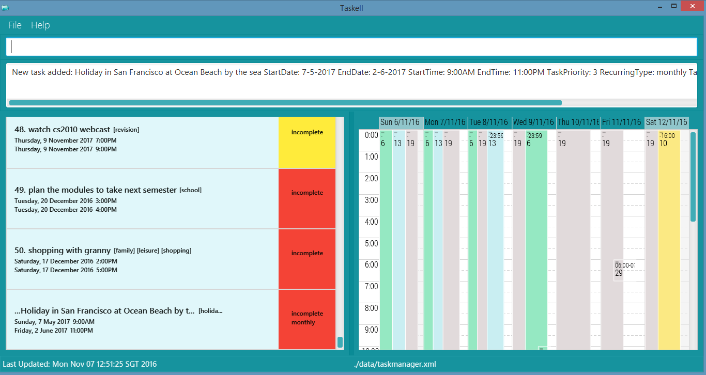 
Figure 2: Adds a new task to Taskell 

> Take note!  
> A task can only contain up to a maximum of 1 start time, 1 end time, 1 start date and 1 end date. Any additional parameter will be treated as part of the description.  
> Any date or time not preceded by 'by', 'on', 'at', 'from' or 'to' will also be treated as part of the description.

Moreover, Taskell is able to automatically make adjustments to the date and time so that the task entered remains relevant.   
Examples: 
- `add` Create powerpoint slides for project <i>from</i> 11pm <i>to</i> 3am  
This task will be added as a valid task that starts today at 11pm and ends  tomorrow at 3am.
- `add` Staycation with friends <i>from</i> sunday <i>to</i> tues  
If today is a Saturday, this task will be added as a valid task that starts from tomorrow and end on this coming Tuesday.  
If today is a Sunday, this task will be added as a valid task that starts from next Sunday and end on the following Tuesday.

<!--- @@author -->

<!--- @@author A0142073R --->

#### Editing a task : `edit`
You can use the `edit` command to edit any parts of a task.  

Format: 
`edit` INDEX [<i>st:</i> NEW_START_TIME] [<i>et:</i> NEW_END_TIME] [<i>desc:</i> NEW_DESCRIPTION] [<i>sd:</i> NEW_START_DATE] [<i>ed:</i> NEW_END_DATE] [<i>p:</i> NEW_PRIORITY] 
 
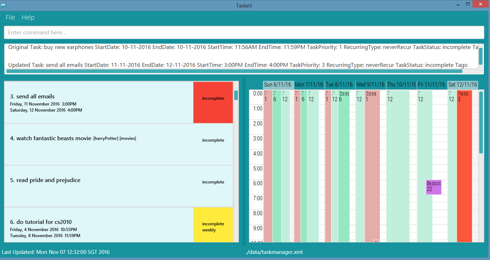 
Figure 3: Edits the third task on the list 

Entering "`edit` 3 desc: send all emails sd: 11-11-2016 ed: 12-11-2016 st: 3pm et: 4pm p: 3", will update description to "send all emails", start date to 11-11-2016, end date to 12-11-2016, start time to 3pm end time to 4pm and priority to 3. 

> Take Note!  
> * You only need to key in the necessary parameters of the task you would like to change. Not all parameters are required.
> * Order of the parameters is not important.
    
<!--- @@author --->

<!--- @@author A0142130A --->  

#### Finding tasks: `find`
You can use the `find` command to view tasks with specific keywords.  

Formats:  
- `find` KEYWORD [MORE_KEYWORDS] 
Displays a list of tasks with description or tags matching all the keywords. 
Example: `find` banana milk essay 
Displays a list of all the tasks with description or tags matching 'banana', 'milk', and 'essay'.  

> Take Note!  
> Tasks with words that match the keyword includes those that contain the keyword. For example, searching for "book" will match with "book", "textbook", "storybook" etc.

- `find-tag` TAG [MORE_TAGS] 
Displays list of tasks with the same tags. 
Example: `find-tag` homework essay cs2103 
Displays a list of tasks having tagged as either 'homework', 'essay', or 'cs2103'.
  
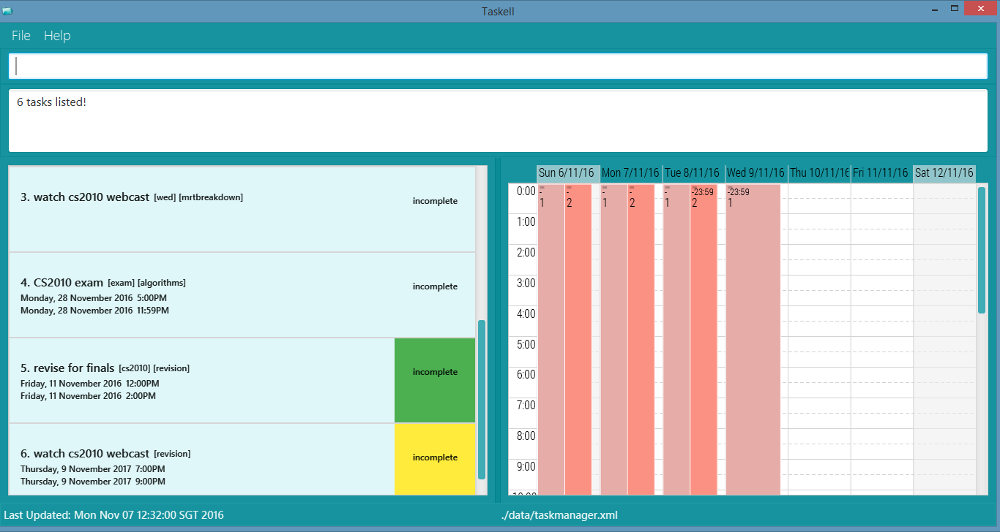   
Figure 4: `find` cs2010 displays list of tasks with 'cs2010' as one of the keywords in task description

> Take Note!  
> * The order of the keywords does not matter. e.g. 'chicken egg' will match 'egg chicken'.
> * Tasks matching at least one keyword will be displayed.
    e.g. 'chicken' will match 'chicken duck'
    
<!--- @@author --->

<!--- @@author A0148004R --->

#### Deleting a task : `delete`
You can use the `delete` command to delete a task at a specified INDEX. 

Format: `delete` INDEX  
Example: `find` violin, then `delete` 1 
Deletes the first task shown in the list after executing the `find` command.
 
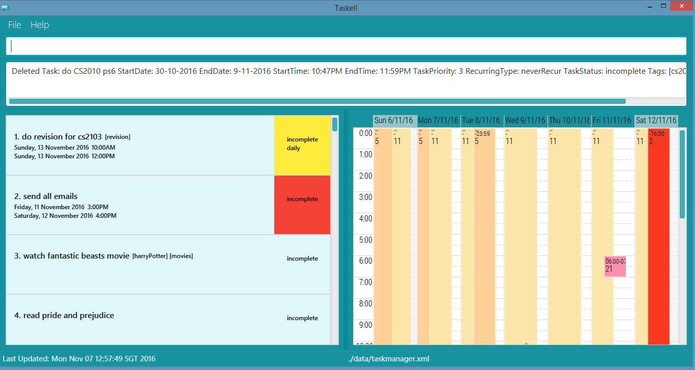 
Figure 5: `delete` 3 deletes the first task on the list 

#### Marking a task as completed: `done`
You can use the `done` command to mark an uncompleted task as completed. 

Format: `done` INDEX 
Example: `done` 1 
Marks the first task as finished and moves it to the list of completed tasks.
 
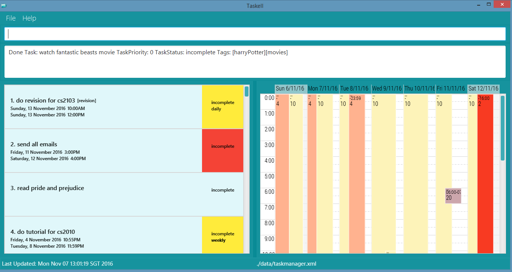 
Figure 6: Marks the third task as finished 

#### Marking a task as incomplete: `undone`
You can use the `undone` command to mark a completed task as uncompleted. 

Format: `undone` INDEX 
Example: `undone` 1 
Marks the first task as incomplete and moves it to the lsit of uncompleted tasks. 

<!--- @@author --->

<!--- @@author A0148004R --->

#### Listing tasks : `list`
You can use the `list` command to display a certain type of tasks. 

Formats: 
- `list`  
Displays a list of uncompleted tasks. 
- `list-all`  
Displays a list of all tasks, both completed and uncompleted. 
- `list-date` DATE   
Displays a list of all the tasks due on the specified date. 
- `list-done`  
Displays a list of completed tasks. 
- `list-priority` PRIORITY 
Displays a list of tasks with the specified priority.
 
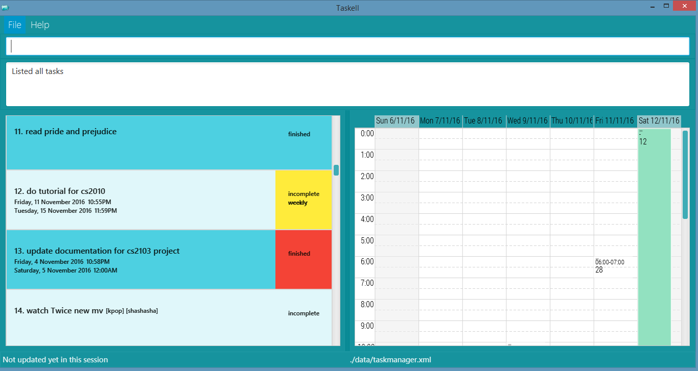 
Figure 8: `list-all` displays both completed and uncompleted tasks 
<!-- @@author -->
   
<!--- @@author A0142130A ---> 

#### Clearing all entries : `clear`
You can use the `clear` command to permanently clear **all** task data.  

Format: `clear`  

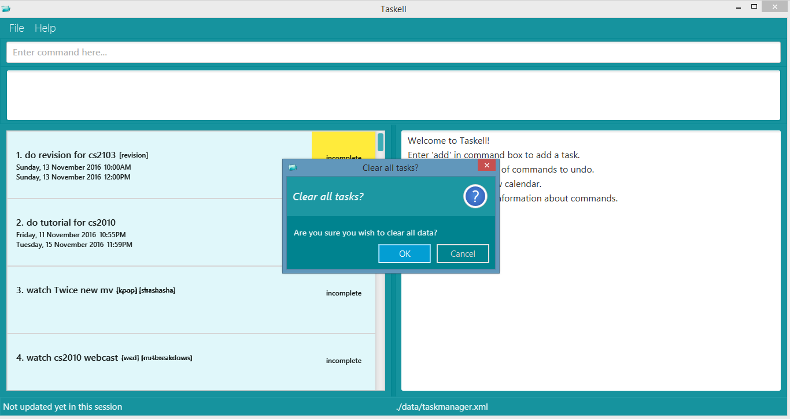 
Figure 9: `clear` prompts a confirmation pop-up window 

> Take Note!  
> * `clear` command is irreversible!

#### Showing history : `history` or `hist`
You can view the command history available for undo on the right panel when undoing your previous commands. 

Format: `history` or `hist` 

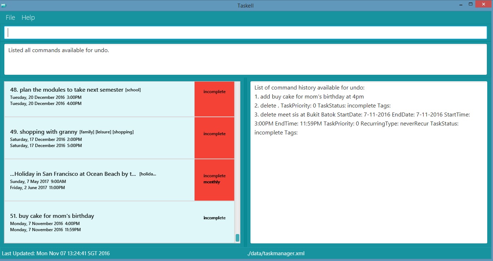   
Figure 10: `hist` displays a list of command history on the right panel

> Take Note!  
> * Only commands that are available for undo will be shown here. 
> * Refer to the `undo` section below for more information on which commands can be undone.

#### Reverting previous action : `undo`
If you wish to undo your most recent action, you can do so by using the `undo` command. 
To undo previous commands, <kbd>Enter</kbd> `hist` to see a list of 
previous commands that can be undone. 
Then use the `undo` command together with the specified INDEX from the list of command history.

Formats:  
- `undo`  
Undo the most recent command executed. 
- `undo` INDEX  
Undo the command at the specified index in the  command history. 
Example: `hist`, then `undo` 3, will undo the third command in the command history.

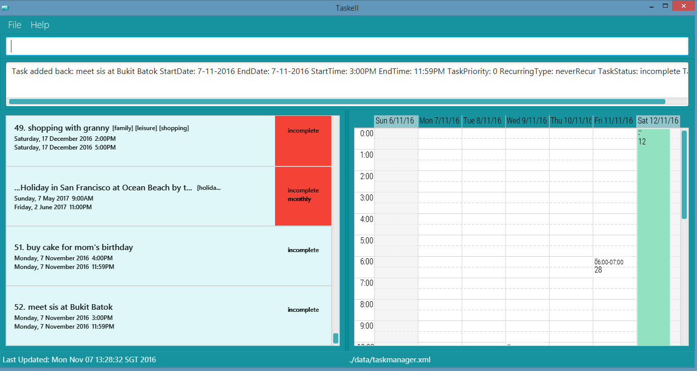 
Figure 11: `undo` reverts the last item on the list of command history

> Take Note!  
> * Undo command only supports `add`, `edit`, `delete`, `done`, `undone` and `undo` commands.
> * `clear` command is irreversible!

#### Showing calendar view : `calendar` or `cal`
You can use the `calendar` command to view a calendar.  

Format: `calendar` or `cal`  

You can refer the calendar on the right panel when adding tasks and scheduling events. A fine red line is used to indicate the current time.
  
 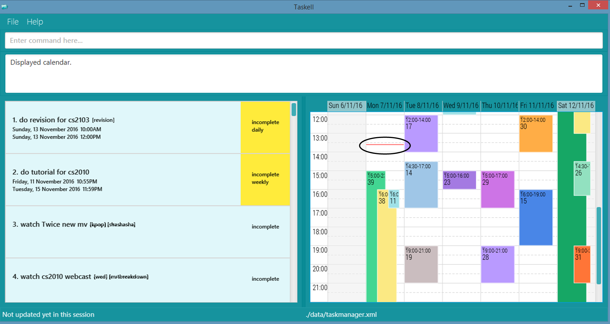  
Figure 12: Example of how the current time marker looks like. 

The calendar view reflects the tasks shown in the left panel. Each block is marked with the index corresponding to the task, meaning a block marked "4" would correspond to the fourth task. 
By default, the calendar view will be shown on the right panel. As the `history` command also utilises the right panel to display the command history, you have to use the `calendar` command to toggle between both views. 

> Take note!  
> Entering other commands (i.e. `find`, `add`) will revert the right panel back to calendar as it is the default view.  

#### Saving the information in Taskell : `save`
You can use the `save` command to specify the path of a folder to store Taskell's data file. Please note that you should have permissions to access the folder.  

Format: `save` FILE_PATH 
Example: `save` C:\Users\Jim\Documents
 

To obtain the file-path, navigate to the required file in your File Explorer. Copy the path at the top of the
screen and paste it into Taskell. Refer to the diagram below for an example of a file-path.  

 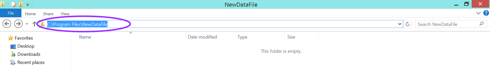  
Figure 13: Screenshot of File Explorer in Windows.   

If the specified directory is valid but the file is missing, for example, if you entered `save` C:\Users\Jim\Documents\Project,  and 'C:\Users\Jim\Documents\Project' is valid
but 'project' file has not been created, Taskell will create the file for you. 

> Take Note!  
> * If you only specify a folder name without directory, i.e. `save` project, Taskell will create a file named 'project' within Taskell's own directory. 
>Whereas `save` C:/Users/Jim/Documents/project will open a file named 'project' within your desktop's Documents folder.
> * Both Windows and Linux OS have restricted symbols that are not allowed for folder names. Please be aware of the symbols
shown in the table below.
    
Windows |  Linux 
-------- | :-------- 
       > | >
       < | <
       : | :
       " | &
       / | /
       \ | &#124;
  &#124; | 
       ? |
       * |
Table 1: Restricted symbols in Windows and linux

<!--- @@author ---> 

#### Exiting the program : `exit`
You can use the `exit` command to exit Taskell.
 
Format: `exit`  

Alternatively, you can hold down <kbd>Alt</kbd> + <kbd>F4</kbd>.  

## FAQ

**Q**: How do I transfer my data to another computer? 
**A**: Install the application in the other computer and overwrite the empty data file it creates with the file that contains the data in your previous Taskell folder. 

<!--- @@author A0142130A --->

**Q**: Do I have to save the data every time I enter new tasks?  
**A**: No, Taskell automatically saves your data every time you enter new tasks. Use `save` only when you want to
transfer your data to a new location on your computer.  

<!--- @@author --->

<!--- @@author A0139257X ---> 

## Glossary

1. GUI: Graphical User Interface
2. Floating task: A task without date and time

<!--- @@author --->

<!--- @@author A0142073R ---> 
     
## Command Summary

Command | Format  
-------- | :-------- 
Add | `add` TASK <i>p/</i>[PRIORITY] <i>#</i>[TAG]   `add` TASK <i>by</i> DATE    `add` TASK <i>by</i> TIME   `add` TASK <i>by</i> DATE <i>by</i> TIME   `add` TASK <i>at</i> TIME   `add` TASK <i>on</i> DATE   `add` TASK <i>on</i> DATE <i>by</i> TIME   `add` Task <i>on</i> DATE <i>at</i> TIME   `add` TASK <i>from</i> DATE <i>to</i> DATE   `add` TASK <i>from</i> TIME <i>to</i> TIME   `add` TASK <i>on</i> DATE <i>from</i> TIME <i>to</i> TIME <i>p/</i>[PRIORITY] <i>#</i>[TAG] <i>r/</i>[RECURRING]
Calendar View | `calendar` or `cal`
Clear | `clear`
Delete | `delete` INDEX
Edit | `edit` INDEX   `desc:` NEW_DESCRIPTION   `sd:` NEW_START_DATE   `st:` NEW_START_TIME   `ed:` NEW_END_DATE   `et:` NEW_END_TIME   `p:` NEW_PRIORITY
Exit | `exit`   <kbd>Alt</kbd> + <kbd>F4</kbd>
Find | `find` KEYWORD [MORE_KEYWORDS]
Find by tag | `find-tag` TAG [MORE_TAGS]
Help | `help`
History | `history` or `hist`
List all tasks | `list-all`
List by priority | `list-priority` PRIORITY
List by specified date | `list-date` DATE
List completed tasks | `list-done`
List uncompleted tasks| `list`
Mark task as finished | `done` INDEX
Mark task as incomplete | `undone` INDEX
Save | `save` FILE_PATH
Undo | `undo`   `undo` INDEX

<!-- @@author -->

<!--- @@author A0139257X --->
## Appendix A

Supported Date Format |   Example  
-------- | :-------- 
DD-MM-YYYY |1-1-2016   1/2/2016  1-mar-2016   1-April-2016   1.May.2016   1.Jun.2016
MM-YYYY  | jul-2016   july-2016
MM  | jan   sept   December
day  | today   tdy   tomorrow   tmr   thursday   thurs   thu

## Appendix B

Supported Time Format |   Example  
-------- | :-------- 
In 12-hour format | 12am   5:30am  1pm   10-35pm   11.45pm
In words | midnight   afternoon   noon

<!-- @@author -->

