# User Guide
* [Introduction](#introduction)
* [Quick Start](#quick-start)
* [Features](#features)
* [FAQ](#faq)
* [Command Summary](#command-summary)
* [Appendix A](#appendix-a)
* [Appendix B](#appendix-b)

<!--- @@author A0142073R ---> 

## Introduction
Are you having a hard time remembering all the work you have to do? Do you have trouble finding a task manager that suits your preference for keyboard input? Well, worry no more, Taskell is here for you!  
Taskell will be your personal secretary. It will keep track of your daily tasks and remind you of any important dates and deadlines. What distinguishes Taskell from other task managers is that Taskell only requires a single line of command for every task input. This means that you can record each one of your tasks with just a single statement. You will no longer have to use a mouse if you do not wish to.  
Ready to begin life anew with a more efficient task manager? Read on to find out more! 

<!--- @@author --> 

## Quick Start

Step 1: Ensure you have Java version `1.8.0_60` or later installed in your Computer. 

  > Having any Java 8 version is not enough.  
    This application will not work with earlier versions of Java 8.

Step 2: Download the latest `taskell.jar` from <a href="https://github.com/CS2103AUG2016-W15-C3/main/releases">here</a>. 
	  
Step 3: Copy the file to the folder you want to use as the home folder for your Task Manager. 
Step 4: Double-click the file to start the application. The GUI should appear in a few seconds.  
  
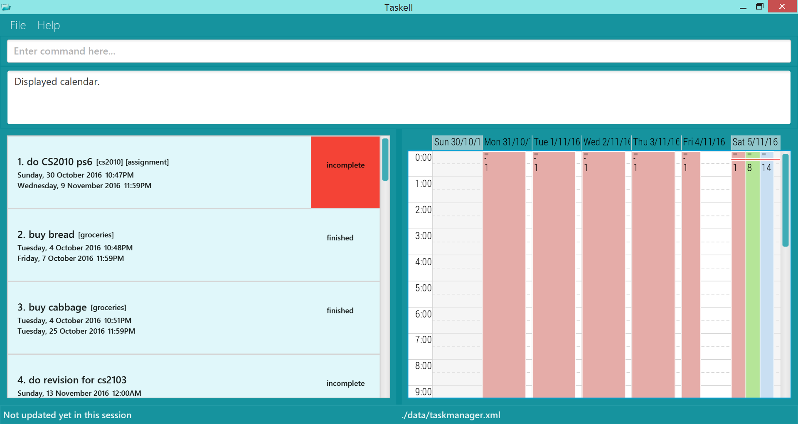  
Diagram 1: A screenshot of the Graphical User Interface (GUI) 

 
Step 5:	Type the relevant command in the command box and press <kbd>Enter</kbd> to execute it. 
Step 6: Some example commands you can try: 
   * **`list`** : displays all contacts
   * **`add`** buy MA1101R textbook today : adds a task called buy MA1101R textbook to be done by today.
   * **`delete`** 3 : deletes the 3rd task shown in the current list
   * **`exit`** : exits the application  
Refer to the [Features](#features) section below for details of each command. 

## Features

This section shows the different commands that you can use in Taskell. Words that are in UPPER_CASE are parameters. These parameters have to be in the order stated below. Words that are in italics are used to identify the parameters while words enclosed in SQUARE_BRACKETS are optional. INDEX refers to the index number shown in the most recent listing.

#### Viewing list of commands : `help`

To open the help window 
 Format: `help`
 
<!--- @@author A0139257X --->

#### Adding a task: `add`
To add a floating task 
Format: 
- `add` TASK  
Example: `add` read Harry Potter Book  

To add a deadline task 
> Please refer to Appendix A and B for date and time format respectively that Taskell supports.  

Formats:
- `add` TASK <i>by</i> [DATE]  
Example: add buy textbook <i>by</i> today 
- `add` TASK <i>by</i> [TIME] 
Example: add visit Sandy at her house by the seaside <i>by</i>  3.35pm 
- `add` TASK <i>by</i>  [DATE] <i>by</i>  [TIME]  
Example: `add` do lab homework <i>by</i> Friday <i>by</i> 7pm

To have a greater flexibility in the command format, Taskell supports a few natural variation such as <i>on</i> and <i>at</i>. 

- `add ` TASK <i>on</i> [DATE] 
Example: `add ` go for meeting <i>on</i> monday  
- `add ` TASK <i>at</i> [TIME]  
Example: `add ` go for meeting <i>at</i> 3pm  
- `add ` TASK <i>on</i> [DATE] <i>at</i> [TIME]  
Example: `add ` go for meeting <i>on</i> Sunday <i>at</i> 3pm  
- `add ` TASK <i>on</i> [DATE] <i>by</i>[TIME]  
Example: `add ` go for meeting <i>on</i> 1-jan <i>by</i> 3pm  

To add an event task 
Formats:
- `add ` TASK <i>on</i> [DATE] <i>startat</i> [TIME] <i>endat</i> [TIME] 
Example: `add ` schedule meeting <i>on</i> Thursday <i>startat</i> 1pm <i>endat</i> 9pm 

- `add ` TASK <i>startat</i>  [TIME] 
Example: `add ` concert by 2am band <i>startat</i> 7pm 

- `add ` TASK <i>endat</i>  [TIME] 
Example: `add ` netball training <i>endat</i> 7pm 

<!--- @@author -->

<!--- @@author A0148004R --->

#### Listing tasks : `list`
Formats: 
- `list`  
Displays a list of uncompleted tasks. 
- `list-all`  
Displays a list of all tasks, both complete and incomplete. 
- `list-date` DATE   
Displays a list of all the tasks due on the specific date. 
- `list-done`  
Displays a list of completed tasks. 
- `list-priority` PRIORITY 
Displays a list of tasks with given priority. 
 
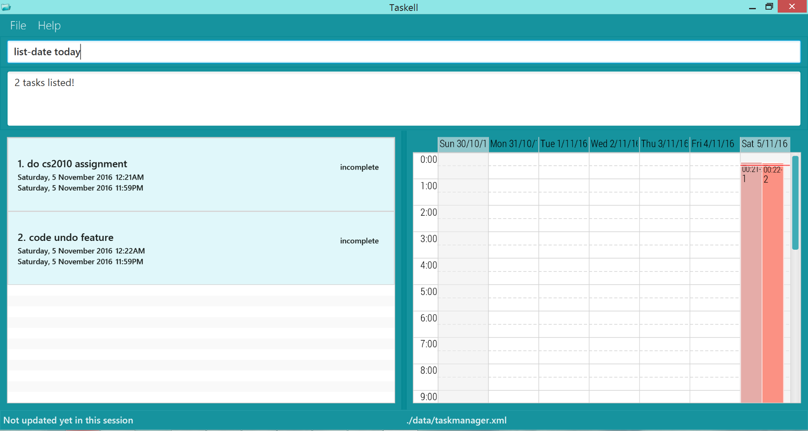  
Diagram 2: Displays all the tasks to be done by today after typing list-date today.

<!-- @@author -->
   
<!--- @@author A0142130A --->  

#### Finding tasks: `find`
You can use the find command to view tasks with specific keywords. Tasks with words that match the keyword include those that contain the keyword, for example, searching for "book" will match with "book", "textbook", "storybook" etc. You can also search with multiple keywords at the same time. 
Formats:  
-`find KEYWORD [MORE_KEYWORDS]` 
Displays a list of tasks with description or tags that match all the keywords. 
Example: `find banana milk essay` 
This returns all tasks with description or tags that match all keywords `banana`, `milk`, and `essay`.  

-`find-tag TAG [MORE_TAGS]` 
Displays list of tasks with the same tags. Use this if you want to only search by tags and not description. 
Example: `find homework essay cs2103` 
This returns any task with either tag `homework`, `essay`, or `cs2103`. 
  
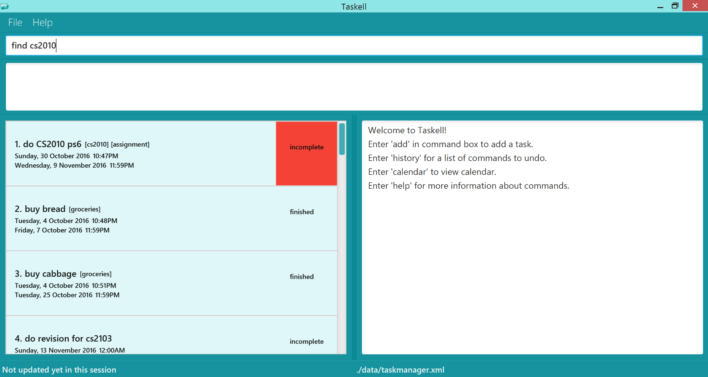 
  
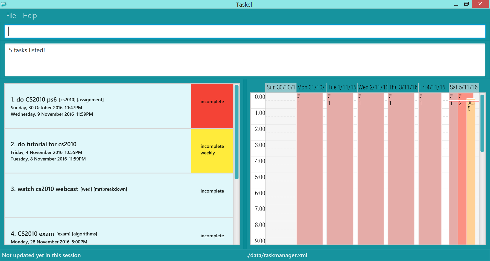   
Diagrams 3 and 4: Keying in `find cs2010` displays list of tasks with "cs2010" as one of the keywords in task description

> Take Note!  
> * The order of the keywords does not matter. e.g. `chicken egg` will match `egg chicken`.
> * Full words will be matched e.g. `chicken` will match `chickens`.
> * Tasks matching at least one keyword will be returned (i.e. `OR` search).
    e.g. `chicken` will match `chicken duck`
    
<!--- @@author --->

<!--- @@author A0142130A ---> 

#### Showing history : `history` or `hist`
You can view the command history available for undo on the right panel to refer to when undoing previous commands. 
To save your time, Taskell has a short form command `hist`.  
Format: `history` 

 
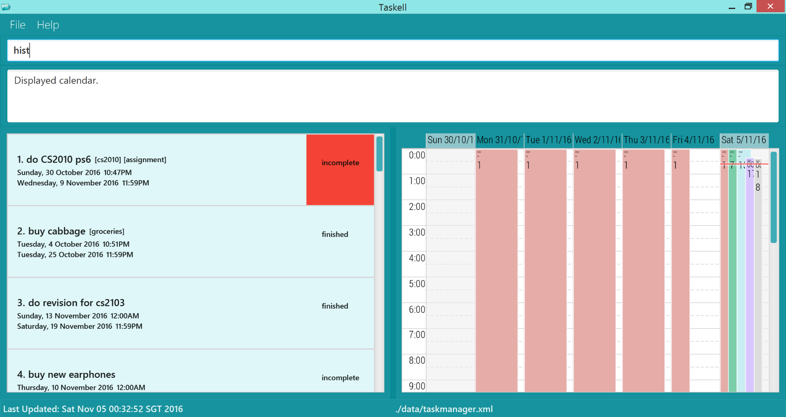 
  
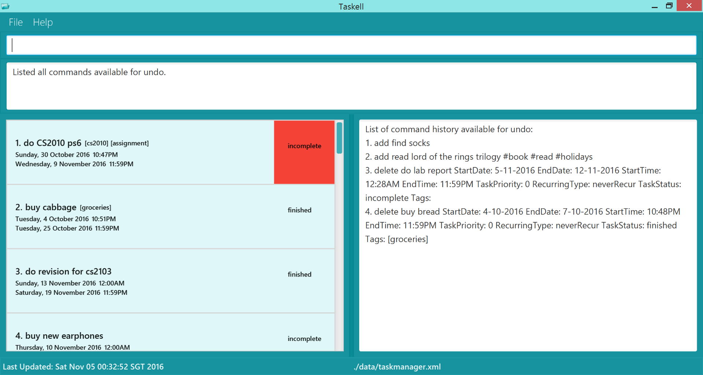   
 Diagrams 5 and 6: `hist` will show list of command history on the right panel

> Take Note!  
> * Only commands available for undo are shown here. 
> * Refer to undo section for more information about what commands undo supports.

#### Reverting previous action : `undo`
If you wish to undo your most recent action, you can do so by using the undo command. 
You can also undo previous commands, <kbd>Enter</kbd> `hist` to see a list of 
previous commands that can be undone. 
Then use undo command with specified INDEX from the list of command history. 
Formats:  
-`undo`  
Undo most recent command executed. 
-`undo INDEX`  
Undo by index of command history. 
Example: `hist`, then `undo 3`, will undo third command in command history. 

  
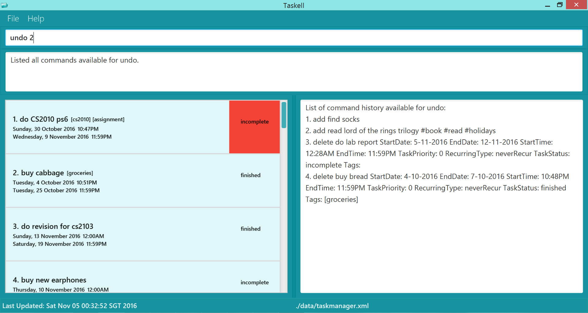 
  
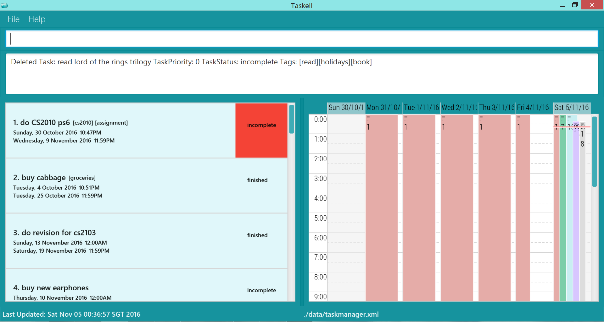   
Diagrams 7 and 8: `undo 2` will undo 2nd command in history

> Take Note!  
> * Undo command only supports add, edit, delete, done, undone and undo commands.
> * Clear commands are irreversible!

<!--- @@author ---> 

#### Deleting a task : `delete`
To delete a task, use the delete command. This command deletes the task at a specified INDEX. The index refers to the index number shown in the most recent listing. 
Format: `delete INDEX` 
Example: `find violin`, then `delete 1` 
This deletes the 1st task in the results of the find command.

<!--- @@author A0142130A --->

  
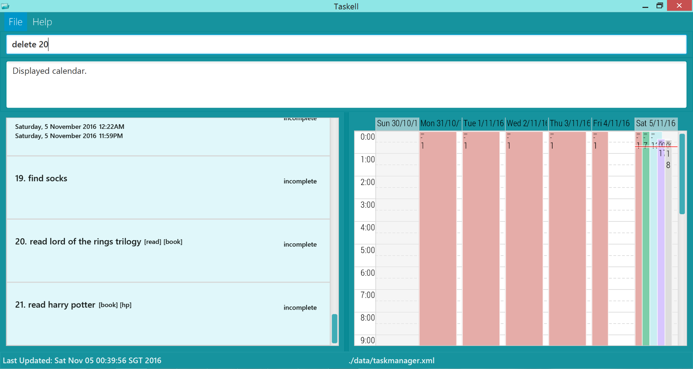 
  
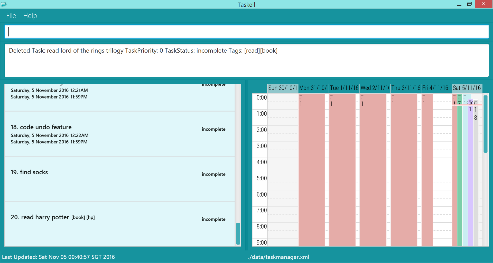  
Diagrams 9 and 10: Entering `delete 20` will delete "read lord of the rings trilogy". 

<!--- @@author --->

<!--- @@author A0148004R --->

#### Marking a task as completed: `done`
Format: `done` INDEX 
Example: `done` 1 
This adds the 1st task as completed and moves it to the completed list. 

<!--- @@author --->

<!--- @@author A0142073R --->

#### Editing a task : `edit`
To edit a task 
Formats: 
- `edit ` INDEX `st: `[NEWSTARTTIME] `et: `[NEWENDTIME] `desc: `[NEWDESCRIPTION] `sd: `[NEWSTARTDATE] `ed: `[NEWENDDATE] `p: `[NEWPRIORITY] 
  
 
Diagram 11: Edits the 1st task on the list. 

Entering "edit 1 desc: send all emails sd: 11-11-2016 ed: 12-11-2016 st: 3pm et: 4pm p: 3", will update description to "send all emails", start date to 11-11-2016, end date to 12-11-2016, start time to 3pm end time to 4pm and priority to 3. 

<!--- @@author --->

<!--- @@author A0142130A ---> 

#### Showing calendar view : `calendar` or `cal`
You can view the calendar for the week on the right panel to refer to the dates and any events scheduled 
when adding tasks and scheduling events. 
By default, the calendar view will be shown on the right panel. As `history` displays command history on the right panel as well, this command is meant for your convenience if you want to view calendar again. 
Please note that entering other commands (i.e. `find`, `add`) will also revert the right panel back to calendar as it is the default view.  
To save your time, Taskell has a short form command `cal`.  
Format: `calendar` 

#### Saving the information in Taskell : `save`
You can specify the path of a folder to store Taskell's data file. Please note that you should have permissions to access the folder.  
To obtain the filepath, navigate to the required file in your File Explorer. Copy the path at the top of the
screen and paste into Taskell. Refer to diagram 12 for an example of a filepath.  

   
Diagram 12: Screenshot of File Explorer in Windows.   

If the specified directory is valid but the file is missing, for example if command is `save C:\Users\Jim\Documents\chicken`,  and `C:\Users\Jim\Documents\chicken` is valid
but `chicken` file is not created, Taskell will create the file for you. 
Format: `save FOLDERPATH` 
Example: `save C:\Users\Jim\Documents`

> Take Note!  
> * If you only specify a folder name without directory, i.e. `save cat`, Taskell will create a file
named "cat" within Taskell's own directory. Whereas `save C:/Users/Jim/Documents/cat` will open a file named "cat" within your desktop's Documents folder.
> * Both Windows and Linux OS have restricted symbols not allowed for filenames. Please be aware of the symbols
shown in the table below.
    
Windows |  Linux 
-------- | :-------- 
    * > | * <
    * < | * >
    * : | * :
    * " | * &
    * / | * /
    * \ | * |
    * | | 
    * ? |
    * * |

#### Clearing all entries : `clear`
Permanently clears **all** task data.  
Format: `clear`  

  
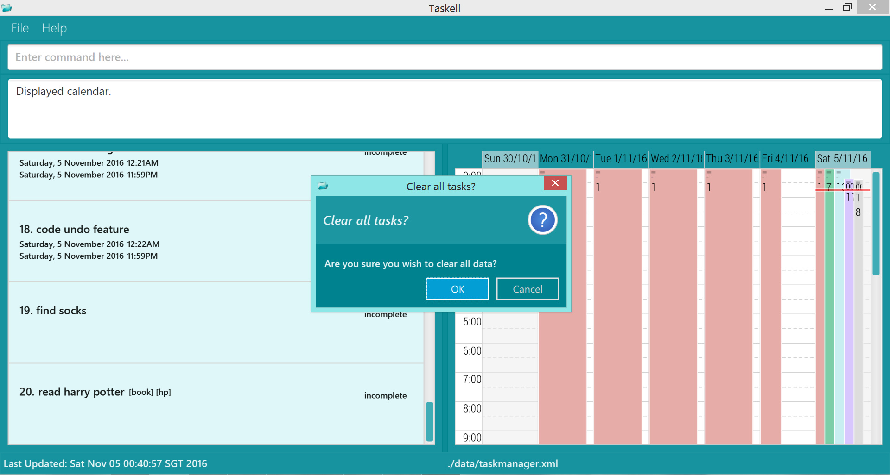  
Diagrams 13: Typing `clear` will prompt a confirm pop-up window  

> Take Note!  
> * Clear commands are irreversible!

<!--- @@author ---> 

#### Exiting the program : `exit`
Format: `exit`  

## FAQ

**Q**: How do I transfer my data to another Computer? 
**A**: Install the application in the other computer and overwrite the empty data file it creates with the file that contains the data of your previous Taskell folder. 

<!--- @@author A0142130A --->

**Q**: Do I have to save the data every time I enter new tasks?  
**A**: No, Taskell auto-saves your data every time you enter new tasks. Use `save` only when you want to
transfer your data to a new location on your computer.  

**Q**: Do I have to use `exit` command when I want to exit the application?  
**A**: There is no need to, as Taskell can be closed by the top right X button with the mouse as well. This command is for your convenience if you prefer to use the keyboard.  

<!--- @@author --->

<!--- @@author A0142073R ---> 
     
## Command Summary

Command | Format  
-------- | :-------- 
Add Floating Task | `add` TASK ITEM 
Add Event | `add` TASK ITEM <strong>by</strong> [DATE]
Add Event | `add` TASK ITEM <strong>by</strong> [TIME]
Add Event With Deadline | `add` TASK ITEM <strong>by</strong> [DATE][TIME]
Calendar View | `calendar` or `cal`
Clear | `clear`
Delete | `delete` INDEX
Edit | `edit` INDEX NEWTASK
Find Tasks | `find` KEYWORD [MORE_KEYWORDS]
Find Tasks by Tag | `find-tag` KEYWORD [MORE_KEYWORDS]
Help | `help`
History | `history` or `hist`
List Incomplete Tasks| `list`
List All Tasks | `list-all`
List by Given Date | `list-date` [DATE]
List Done Tasks | `list-done`
Mark Task Done | `done` INDEX
Mark Task Undone | `undone` INDEX
Undo | `undo` or `undo` INDEX

## Appendix A

Supported Date Format |   Example  
-------- | :-------- 
DD-MM-YY |1-1-16 
DD-MM-YY  | 1-1-2016 
DD-MM-YY  | 1-Jan-2016
DD-MM-YY  | 1-January-2016  
DD-MM-YY  | 1.Jan.2016
DD-MM-YY  | 1.January.2016  
MM-YY  | july-16
MM  | july
day  | today
day  | tdy
day  | tmr
day  | tomorrow
day  | thursday

## Appendix B

Supported Time Format |   Example  
-------- | :-------- 
12hour |1pm
12hour |12am
12hour |11.45pm

<!-- @@author -->
